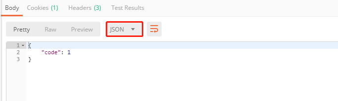
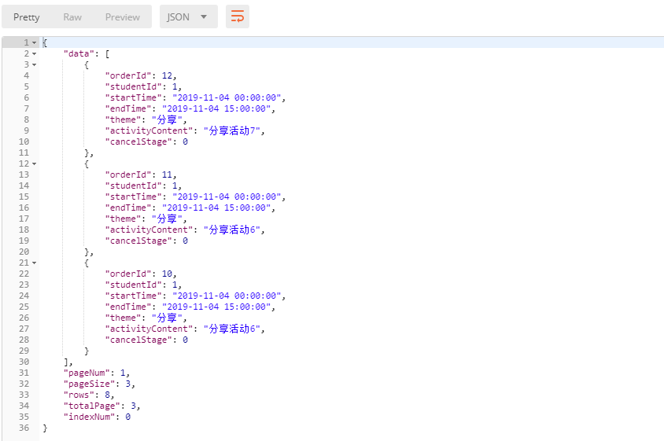
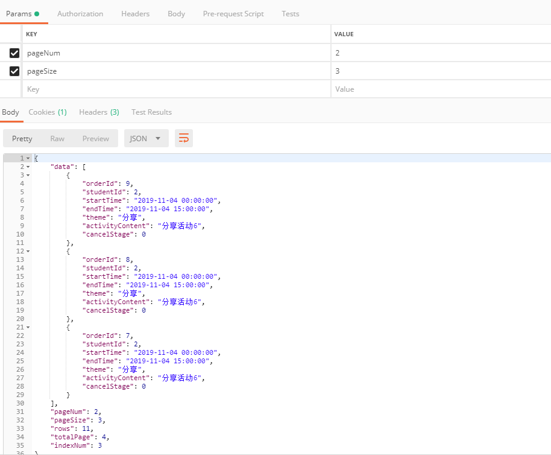

# 接口文档

##  1. 登录功能
* http://localhost:8080/HuaJu/loginPage/login
* @param name 姓名 String
* @param password 密码 String
* @return code : 0 登录失败（用户名或密码错误），1 登录成功 ，-1 系统异常

## 2. 提交预定
* http://localhost:8080/HuaJu/orderPage/submitOrder
* @param startTime 开始时间 String
* @param endTime 结束时间 String
* @param theme 主题 String
* @param activityContent 活动内容 String
* @return  code: -1 提交失败（系统异常） 1 提交成功 int

## 3. 查询我的预约
* http://localhost:8080/HuaJu/orderPage/findRecordOfOne
* @param pageNum 当前页数 int
* @param pageSize 每一页显示数据 int
* @return 返回一页的数据 List<Order> 系统异常返回 code : -1

## 4. 查询所有预约
* http://localhost:8080/HuaJu/orderPage/findAllRecord
* @param pageNum 当前页数 int
* @param pageSize 每一页显示数据 int 系统异常返回 code : -1

## 5. 取消预约
* @param orderId 预约id String
* @param startTime 预约时间 String
* @return code: 0 过时不能取消 -1 取消失败（系统异常） 1 取消成功 int

## 注意
- 如果前台不能获取session  可提供接口直接用于获取 用户对象
- startTime 格式：yyyy-MM-dd hh:mm:ss
- endTime 格式：yyyy-MM-dd hh:mm:ss
- session中存放属性：key = "loginUser"  value = (Student)对象
- (Student)对象包含属性（提供给你用于提交界面的填写）：
    Integer studentId;
    String name;
    String password;
    String section;
    String phoneNum;
    String weChatNum;
    String QQNum;

- 系统异常返回：-1